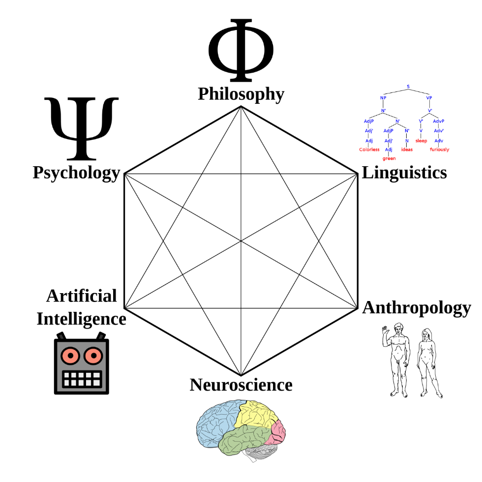
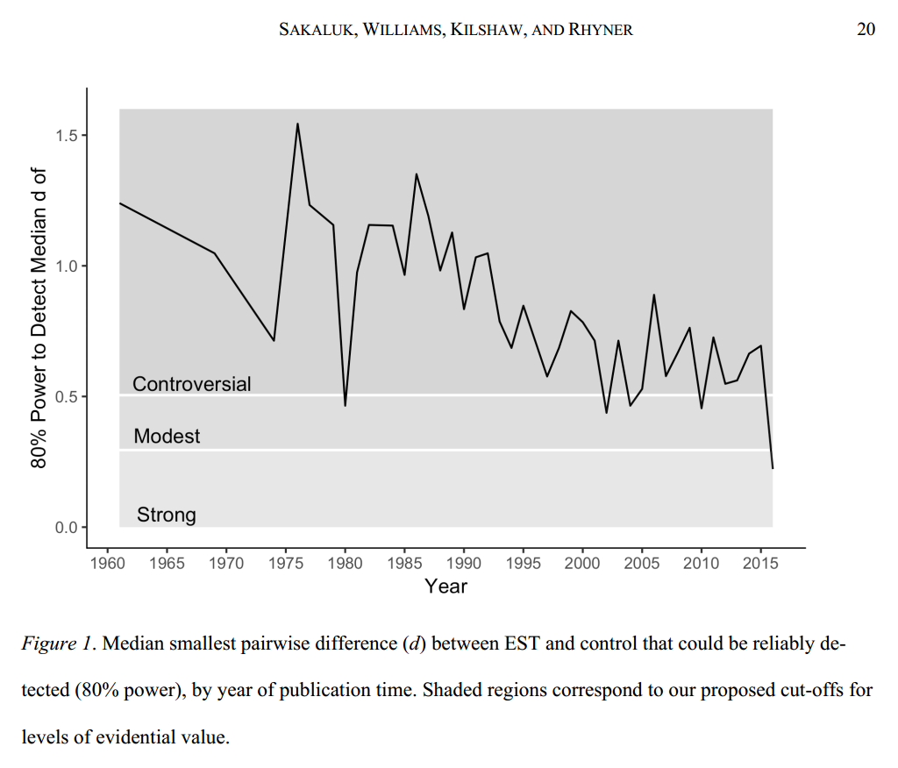

Когнитивистика/cognitive science --- это то, что стало с психологией,
когда там перестали заниматься «учением о душе» (психэ --- это душа,
логия --- это учение). С временем слово «когнитивистика» (cognitive
science) потеряло все свои специальные значения и теперь означает по
факту «всё, что имеет отношение к человеку, как мыслящему
существу»^[<https://en.wikipedia.org/wiki/Cognitive_science>].
Вот иллюстрация и статьи в википедии по cognitive science.

Поскольку cognition --- это «познание», отличающее человека от всей
остальной природы, а в последние несколько лет вдруг появились системы
искусственного интеллекта, которые проявляют похожие свойства, то теперь
«когнитивистика» относится уже вообще ко всем видам агентов с высокой
степенью вменяемости и умениями планирования, но уже понятно, что они
обладают общей чертой: реализованы на нейронных сетях (спайковых как в
мозгу человека или ReLU, как в современных больших языковых моделях,
абсолютно неважно: доказаны теоремы об эквивалентности работы спайковых
и ReLU
сетей^[<https://arxiv.org/abs/2306.08744>],
и даже больше --- квантовых
нейросетей^[<https://www.nature.com/articles/s43588-021-00084-1>]),
плюс обсуждается, что и биологический мозг можно приспособить для
создания «искусственного интеллекта» на «естественной нейронной
основе»^[<https://www.frontiersin.org/journals/science/articles/10.3389/fsci.2023.1017235>].

После того, как выяснилось, что и современная психология, и философия, и
лингвистика, и антропология и даже искусственный интеллект строят свои
теории с опорой на объяснения нейронауки (которая оказалась даже не
нейрофизиологией, то есть необязательно связана с биологическим
человеческим мозгом, но отражает некоторые более общие закономерности
нейро-вычислителей), когнитивистика как «всё о человеке» по факту в
методике обучения была заменена на прямые отсылки к нейронауке. Хотя у
нейронауки пока не так много детальных объяснений «как работает
человеческий мозг» (классическая нейронаука, часто говорят сейчас именно
о нейрофизиологии), или даже «как работает нейросеть на ReLU или других
методах активации, или другой природы --- спайковой или квантовой»
(representations learning и отдельно deep learning) на том системном
уровне, чтобы из этих объяснений можно было хоть как-то надёжно вывести
верхнеуровневые суждения о поведении.

А ещё (по традиции психологии) исследования выполняются главным образом
над студентами именно психологических факультетов стран «золотого
миллиарда», поэтому выводы по разным причинам или оказываются не слишком
надёжными, или непереносимыми на других людей (скажем, на инженеров, или
музыкантов, или студентов каких-то стран не из «золотого миллиарда»).
Именно в работах по психологии и когнитивистике (и отчасти социологии,
что тоже имеет отношение к образованию, ибо образование-то идёт обычно в
группах) наблюдается самый жестокий кризис воспроизводимости, то есть
результаты исследований не могут быть воспроизведены в других
лабораториях, поэтому на них нельзя опереться. Это усугубляется ещё и
тем, что психологи и социологи имеют практически нулевую подготовку в
области статистики, они незнакомы с causal inference и поэтому влёгкую
манипулируют первичными данными экспериментов, подгоняя результаты под
свои гипотезы.

Когнитивистика (и дальше нейронаука) сейчас главным образом поддерживает
как психологию в её нынешних изводах (а там уже нет «психологии
здорового человека», есть только психотерапии/«ремонты» и далее всё, что
приходит из медицины: не «клиент» психолога, а «пациент» психотерапевта,
лицензирование работы психолога как врача, жёсткое государственное
регулирование психотерапии, и много чего другого), так и
«нетерапевтическое» обсуждение поведения людей, а в последнее время и
поведения агентов на основе нейросетевого искусственного интеллекта. В
том числе когнитивистика и нейронаука кладутся в обоснования практик
методики обучения, помогают ответить на вопрос «как лучше, быстрей,
дешевле, надёжней изменить личность».

Опора методики обучения на когнитивистику и нейронауку помогает не
только в методике обучения как методике проведения классических учебных
программ (как в учебных заведениях), но и в продвижении (нейромаркетинг,
при всех вопросах к тому, что это такое), собственно практике
психотерапии (которую мы тоже рассматриваем как обучение), коучинге и
так далее. То есть по факту когнитивистика в целом и нейронаука как её
основная часть в частности --- это попытки как-то обозначить те
исследования, которыми раньше занималась психология, эргономика и другие
науки о человеке, но которые не имеют в своей основе терапевтических
целей, а просто пытаются понять, как же действует человек, как он
принимает решения.

Все дорожки к чему-то вменяемому и неэзотерическому в когнитивистике
идут сначала к нещадно критикуемой (в том числе и в том, что она
игнорирует подробное исследование причин и следствий), но отлично
работающей
поведенческой^[<https://en.wikipedia.org/wiki/Behaviorism>]
терапии, далее после «когнитивной революции» в психологии это стало
поведенческой когнитивной
терапией^[<https://en.wikipedia.org/wiki/Cognitive_behavioral_therapy>].
Конечно, появились и варианты поведенческой терапии с
mindfulness^[<https://en.wikipedia.org/wiki/Mindfulness-based_cognitive_therapy>],
так что тут тоже нужно быть осторожным.

Отдельные методы/приёмы/практики/паттерны/модели/интервенции/процедуры
(как их только не называют! мы дальше называем их психопрактиками)
изменений в нейронной сети вменяемого агента (прежде всего человека) все
очень и очень похожи в своей сути. Так, похожесть фокусирования/focusing
и ряда практик нейролингвистического программирования не замечалась
разве ленивым. Развитие всех этих уже довольно старинных практик
продолжается, ранние формы когнитивной поведенческой терапии --- это
oNLP и все последующие течения (Clean
Language^[<https://www.cleanlanguage.co.uk/>],
neuro-linguistic psychology и даже neuro-linguistic
philosophy^[<https://www.nlp-institutes.net/>],
эриксонианский
гипноз^[<https://www.erickson-foundation.org/>],
фокусирование^[<http://focusing.org/>]. В
диссертации Dr.Lucas Derks (2016) о ментальном пространстве (mental
space), исследующей пространственные представления, он обращается к 24
подобным школам психопрактической
мысли^[<https://www.ucn.edu.ni/media/2016/12/Dr-Lucas-Derks-NLPsy.pdf>].

Типичный пример подачи SoTA в текущих психопрактиках --- «сборники
паттернов», типа обзора 25 CBT Techniques and Worksheets for Cognitive
Behavioral
Therapy^[<https://positivepsychologyprogram.com/cbt-cognitive-behavioral-therapy-techniques-worksheets/>]
или книги Shlomo Vaknin «The Big Book of NLP, Expanded: 350+ Techniques,
Patterns & Strategies of Neuro Linguistic
Programming»^[<https://www.amazon.com/Big-Book-NLP-Expanded-Programming/dp/9657489083/>].
Проблема в том, что это именно наборы паттернов, это не похоже на
какие-то теоретические модели. Некоторый винегрет осколков разных
психотехнических, психологических и даже эзотерических школ в виде
набора паттернов излагается в подобных сборниках на разных логических
уровнях^[<http://www.nlpu.com/Articles/LevelsSummary.htm>],
разных системных уровнях, в различных языках. Пока нет общих понятий,
нет общей теории, это всё несравнимые методы. Работают ли они? Итоговый
график мета-обзора по проверке работоспособности методов психотерапии
(EST, empirically supported
treatment)^[<https://psyarxiv.com/pzbhw/download>]:

Читать его нужно так: до 2015 года эксперименты не подтверждали
работоспособность методов психотерапии, с 2015 года что-то (в публикации
приводятся конкретные виды вмешательств) начало подтверждаться. Но с
учётом общего вида графика ничего определённого утверждать нельзя. Так
что методы психотерапии есть, но работоспособность их в целом непонятна,
и только-только в этой области что-то начало происходить. Заметим, что
ещё и методы оценки подобных исследований тоже претерпевают изменения
(наука признала байесовский причинный вывод, а сейчас обсуждается
переход на квантовоподобные оценки, это обсуждалось в курсе
«Интеллект-стек»). Так что психопрактики только-только становятся хоть
как-то научными и экспериментальными, а не предметом веры и прикидками
на глазок, что «это работает» (обычно только в руках автора метода, и в
его же глазах, как и астрология).

Подаются на основе когнитивистики и нейронауки для методики обучения
главным образом «практические приёмы», стоящая за ними «философия»,
какая-то дисциплина и объяснения, обоснования и т.д. оказываются
отрезанными. Отсюда эффект профанации этих дисциплин:
нейролингвистическим программированием, фокусированием и всем подобным
занимаются «практики», которые не приучены глубоко думать --- они не
знают дисциплины, но прошли «трёхдневные курсы». Всем этим
психопрактикам не хватает прежде всего кругозора: понимания, как связаны
все эти психопрактики, на каких теориях они основаны, какие механизмы
более низких системных уровней используют, какие там типовые жизненные
циклы при работе с психикой, какие бывают роли в
психопрактических/психологических проектах и т.д.

Когнитивистика исследует различные эффекты, которые могут быть
использованы как для обучения, так и для «просто жизни». Например,
«мышление
письмом/моделированием»^[<https://ailev.livejournal.com/1513051.html>]
и GTD используют эффект
Зейгарник^[[https://ru.wikipedia.org/wiki/Эффект\_Зейгарник](https://ru.wikipedia.org/wiki/Эффект_Зейгарник)]:
мозг одинаково воспринимает окончание действия и окончание записи о
действии, после чего выкидывает ситуацию действия (актуального, или о
котором сделали запись) из памяти, происходит так называемое «закрытие».

Студентов мы учим держать мозг пустым, обеспечивая «закрытие» как можно
чаще. В играх и обучении может быть всё наоборот: в играх маркетологи
стремятся продлить игровую сессию и не допускают проявления эффекта
Зейгарник, не допускают «закрытия», и то же самое может быть верно для
учебных занятий. Во время занятий --- никакого «закрытия», но зато может
быть закрытие после занятия.

Тут же можно указать в качестве примера использования моделей нейронауки
и на модель COIN^[Небольшой обзор в
<https://zuckermaninstitute.columbia.edu/brain-context-key-new-theory-movement-and-memory>,
оригинальная статья
<https://www.biorxiv.org/content/biorxiv/early/2020/11/23/2020.11.23.394320.full.pdf>,
Дальше нужно идти по статьям, которые эту статью цитируют:
<https://scholar.google.com/scholar?cites=10583813398280779251&as_sdt=5,33&sciodt=0,33&hl=en>
(и там уже с ноября 2021 года успело набраться довольно много разного
интересного).] (context inference), которая объясняет
механизмы вспоминания каких-то действий: вспоминаются те прошлые
действия, контекст выполнения которых кажется мозгу наиболее похожим
(скорее всего, тут квантовоподобная похожесть, даже не байесовская) на
текущий контекст. В оригинальной работе исследовались физические
действия, но очень похоже на то, что это будет верно для самых разных
операций, ибо раньше исследования в когнитивистике показали, что
мышление как таковое развилось по образу и подобию моторных действий.
Конечно, втащить память о действии в другой контекст можно через
осознанное рассуждение, но это требует специальных усилий: вы можете
просто не вспомнить в критической ситуации, какое действие нужно
втаскивать в текущий контекст! Грубо говоря, если вы оказались в воде в
бассейне, будете плыть брассом и кролем (контекст! Вы учились этому в
бассейне!), а если упали в речку --- то вполне можете и не вспомнить
брасс или кроль, будете плыть как в детстве, по-собачьи. Но если в реке
учились плавать «правильно» хотя бы разок --- нет проблем, поплывёте
«как учили»! Вы можете использовать модель COIN (context inference) для
того, чтобы обеспечить transfer of learning/transfer of
practice/teaching for transfer --- если вы знаете, что вызов из памяти
действия обеспечивается именно его контекстом, то вы в обучение
добавляете большое число контекстов, это будет обсуждаться в нашем курсе
чуть позднее.

Так что современной теорией обучения и образования является
когнитивистика, ничего специального из области собственно обучения
(педагогики, instructional design) тут нет, никаких особых
педагогических теорий поведения человека в обучении, или теорий
поведения человека из instructional design, только прямое обращение к
cognitive science и neuroscience, включая даже обучение на базе каких-то
терапевтических практик, которые методисты и преподаватели будут
применять не в лечебных, а в учебных проектах.

Главное --- в когнитивистике нет сегодня каких-то компактных более-менее
универсальных объяснений, как стандартная теория в физике, или
общепризнанное описание химических связей и химических реакций как в
химии. Нельзя освоить какую-то версию дисциплины, можно только
знакомиться с какими-то отдельными идеями и пробовать их использовать в
своих образовательных проектах. Самый же продуктивный ход на сегодня ---
это использование не когнитивистики в целом, а нейронауки, причём той её
части, которая занимается системами искусственного интеллекта, обучением
интеллектуальных компьютерных агентов. Вот тамошние находки методики
обучения компьютерных агентов надо нести в методику обучения также и
агентов-людей.
